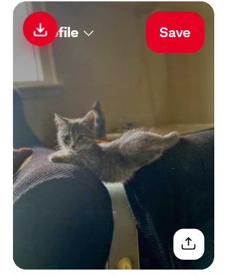
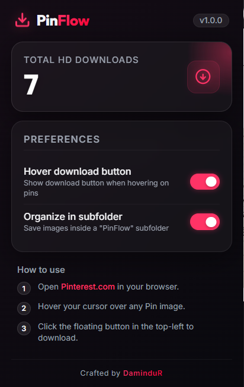

# PinFlow — Pinterest Original Downloader

**PinFlow** is a premium, lightweight Google Chrome & Microsoft Edge extension designed to make downloading high-resolution assets from Pinterest effortless. It injects a beautiful, responsive hover button directly onto Pinterest cards and detail pages, letting you download original uncompressed source files in one click—bypassing the multi-step menus.

---

## 📸 Screenshots

### 1. Injected Download Button (Hover State)
*Hover over any Pin on the Pinterest feed to instantly reveal a clean, white-glass button in the top-left corner. Hovering over the button itself transitions it to a striking Pinterest Red color.*

### 2. Premium Glassmorphic Dashboard
*Open the extension menu to access a dark-glass settings panel. Toggle hover controls on/off reactively, choose whether to organize files into a subfolder, and watch the total downloaded item counter animate upward.*

### 3. Smart Filename & Status Check
*Files are automatically saved using clean, descriptive filenames derived directly from the Pin's description or nearby tags, replacing spaces with neat underscores.*

---

## ✨ Key Features

1. **One-Click Download**: Instantly saves photos directly from your feed or detail page.
2. **Original Quality Resolution**: Automatically converts standard compressed previews (e.g. `236x`, `564x`, `736x`) to the uncompressed `/originals/` directory on Pinterest's CDN.
3. **Smart 404 Fallback Engine**: If a specific pin doesn't host an uncompressed "original" file, PinFlow's background script automatically self-corrects and downloads the highest available quality preview instead of failing.
4. **Descriptive Naming**: Converts Pin alt text descriptions (e.g., `Sunset_over_mountains.jpg`) into clean, sanitized filenames.
5. **Interactive Popup**: Custom controls to show/hide hover buttons dynamically on active tabs, and toggle folders.
6. **Zero Lag**: Styled using CSS hover selectors (`.pinflow-card-wrapper:hover`) which execute natively on hardware-accelerated rendering threads rather than taxing your CPU.

---

## 🚀 How to Install and Use (Developer Mode)

To load PinFlow locally on your browser:

### Step 1: Download/Clone the Repository
Clone this repository or download it as a ZIP and extract it to a directory (e.g., `D:\my-ai-gen\pin dw`).

### Step 2: Open Extensions Management
*   In Google Chrome: Go to URL `chrome://extensions/`
*   In Microsoft Edge: Go to URL `edge://extensions/`

### Step 3: Enable Developer Mode
Toggle the **Developer mode** switch in the **top-right corner** of the page to **ON**.

### Step 4: Load Unpacked Extension
1. Click the **Load unpacked** button (top-left).
2. Navigate to your extracted directory containing the `manifest.json` file.
3. Click **Select Folder**.
4. Open [Pinterest.com](https://pinterest.com) and start downloading!

---

## 🛠️ Codebase Structure

*   `manifest.json` — Chrome MV3 extension specifications, host access declarations, and permissions.
*   `background.js` — Service worker mapping CDN URLs, handling download requests, and routing fallback processes.
*   `content.js` — Injected script scanning page elements, inserting buttons, and reading alt attributes for filenames.
*   `content.css` — Button style, animations, and transitions.
*   `popup.html` / `popup.css` / `popup.js` — Glassmorphic popup menu and controller logic.
*   `assets/` — Repository screenshot resources.
*   `icons/` — Extension branding assets.

---

## 🛡️ License

This project is licensed under the MIT License - see the [LICENSE](LICENSE) file for details.

---

## 👤 Author

Developed with ❤️ by **DaminduR**.
